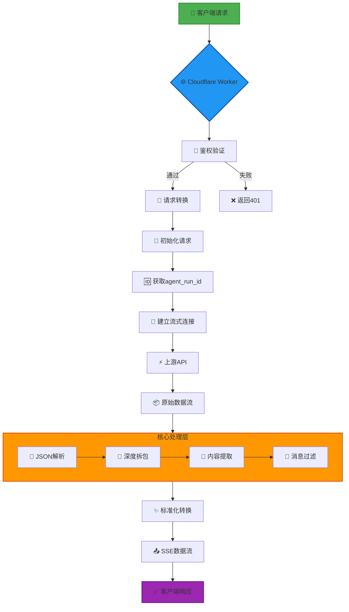
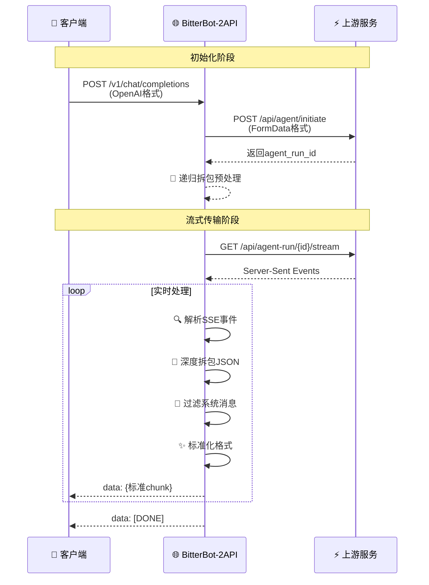
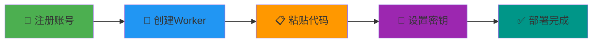
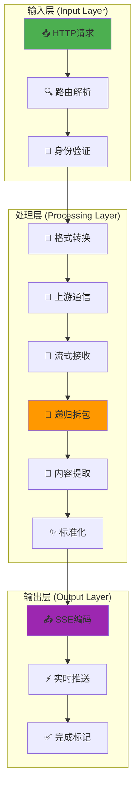

# 🚀 BitterBot-2API (Cloudflare Worker 终极修正版)

[](https://opensource.org/licenses/Apache-2.0)
[](https://workers.cloudflare.com/)
[](https://github.com/lza6/bitterbot-2api-cfwork)
[](https://platform.openai.com/docs/api-reference)

> **"代码不仅是逻辑的堆砌，更是连接混乱与秩序的桥梁。"** 🌌
>
> 本项目致力于将私有的、非标准的上游接口，通过边缘计算的力量，转化为通用的、优雅的 OpenAI 标准格式。让每一个字节都自由流动，让每一次对话都畅通无阻。

---

## 📖 目录

- [🌟 项目简介与哲学](#-项目简介与哲学)
- [✨ 核心特性](#-核心特性-v220)
- [🏗️ 系统架构](#-系统架构)
- [🛠️ 技术原理深度解析](#-技术原理深度解析)
- [🚀 懒人部署教程](#-懒人部署教程-小白友好)
- [⚙️ 详细配置与使用](#-详细配置与使用)
- [🧩 项目结构与AI蓝图](#-项目结构与-ai-蓝图)
- [🔮 优缺点与未来路线图](#-优缺点与未来路线图)
- [📜 开源协议与致谢](#-开源协议与致谢)

---

## 🌟 项目简介与哲学

**BitterBot-2API** 是一个运行在 **Cloudflare Workers** 上的轻量级 API 网关，旨在将非标准的上游接口转化为 OpenAI 兼容的 API 格式。

在当今的 AI 浪潮中，我们面临着无数的接口孤岛。有的接口返回 JSON，有的返回纯文本，有的甚至把 JSON 藏在字符串里（套娃）。本项目的初衷很简单：**抹平差异**。

无论上游多么复杂，我们对外只提供一个统一的、标准的 `v1/chat/completions` 接口。这不仅是为了方便，更是一种对**技术标准化**的致敬。当你看到混乱的数据流被清洗成整齐的 SSE (Server-Sent Events) 推送时，你会感受到一种秩序之美。🧘‍♂️

---

## ✨ 核心特性 (v2.2.0)

<div align="center">

| 特性 | 描述 | 状态 |
|------|------|------|
| 🧠 **递归JSON拆包** | 智能解析嵌套JSON，解决"源码泄露"问题 | ✅ |
| 🌊 **原生流式处理** | 实时过滤和转换数据流，极低延迟 | ✅ |
| 🎭 **完美伪装** | 自动添加合法请求头，绕过检测 | ✅ |
| 👻 **无状态会话** | 基于guest_id的匿名会话管理 | ✅ |
| 🖥️ **内置WebUI** | 开箱即用的调试界面 | ✅ |
| 🔐 **密钥保护** | 支持API密钥验证 | ✅ |
| 🌐 **CORS支持** | 完整的跨域资源访问支持 | ✅ |

</div>

---

## 🏗️ 系统架构



### 🔄 数据流详解



---

## 🛠️ 技术原理深度解析

### 1. 🏗️ 边缘计算架构 (Cloudflare Workers)
- **技术栈**: V8 Isolate + Serverless Functions
- **优势**: 全球分布式部署，毫秒级响应，每日10万次免费调用
- **应用场景**: API网关、实时数据转换、边缘缓存

### 2. 🧠 递归拆包算法 (智能JSON解析)
```javascript
/**
 * 🧬 核心拆包逻辑 - 解决Double Wrapping问题
 * 层级识别 → JSON解析 → 类型判断 → 内容提取
 */
function recursiveUnpack(data) {
    // 第一层：基础JSON解析
    if (typeof data.content === 'string') {
        const trimmed = data.content.trim();
        
        // 检测JSON特征：{...} 格式
        if (trimmed.startsWith('{') && trimmed.endsWith('}')) {
            try {
                const innerData = JSON.parse(trimmed);
                
                // 识别系统消息特征
                if (innerData.status_type || innerData.role) {
                    // 递归处理嵌套结构
                    return recursiveUnpack(innerData);
                }
            } catch (e) {
                // 非JSON字符串，保持原样
            }
        }
    }
    
    return extractContent(data);
}
```

### 3. 🌊 流式转换引擎
```javascript
// 使用TransformStream实现零拷贝数据流处理
const transformer = new TransformStream({
    async transform(chunk, controller) {
        // 实时解码 → 分行 → 解析 → 过滤 → 编码
        const lines = decoder.decode(chunk).split('\n');
        
        for (const line of lines) {
            if (this.isValidSSE(line)) {
                const processed = await this.processLine(line);
                controller.enqueue(encoder.encode(processed));
            }
        }
    }
});
```

### 4. 🎭 请求伪装机制
| 请求头 | 值 | 作用 |
|--------|----|------|
| `Origin` | `https://bitterbot.ai` | 模拟合法来源 |
| `Referer` | `https://bitterbot.ai/` | 模拟页面跳转 |
| `User-Agent` | Chrome 143.0 | 模拟真实浏览器 |
| `Accept` | `text/event-stream` | 声明SSE支持 |

---

## 🚀 懒人部署教程 (小白友好)

### 🎯 准备工作
1. 拥有 [Cloudflare](https://dash.cloudflare.com/) 账号（免费）
2. 确保账户可创建 Workers（默认开启）

### 📝 三步部署法



#### 步骤一：创建Worker
```bash
# 1. 登录 Cloudflare Dashboard
# 2. 点击左侧「Workers & Pages」
# 3. 点击「Create Application」→「Create Worker」
# 4. 输入名称（如：my-bitterbot）
# 5. 点击「Deploy」
```

#### 步骤二：粘贴代码
1. 点击「Edit code」按钮
2. **完全清空**默认代码
3. 复制本项目代码并粘贴
4. 点击「Deploy」按钮

#### 步骤三：配置密钥（可选但推荐）
```bash
# 1. 进入 Worker 「Settings」
# 2. 选择「Variables」
# 3. 点击「Add variable」
#    - Name: API_MASTER_KEY
#    - Value: sk-your-secret-key-here
# 4. 点击「Save」
```

<div align="center">
  
**🎉 恭喜！你的API已上线**
```
https://my-bitterbot.your-subdomain.workers.dev
```

</div>

---

## ⚙️ 详细配置与使用

### 🔌 客户端配置
| 客户端 | 配置示例 |
|--------|----------|
| **OpenAI SDK** | `baseURL: "你的Worker地址"` |
| **NextChat** | 自定义接口配置 |
| **LobeChat** | 模型提供商设置 |
| **cURL** | 见下方示例 |

### 🔐 API调用示例
```bash
# 基本调用
curl -X POST "https://your-worker.workers.dev/v1/chat/completions" \
  -H "Authorization: Bearer sk-123456" \
  -H "Content-Type: application/json" \
  -d '{
    "model": "bitterbot-default",
    "messages": [{"role": "user", "content": "你好"}],
    "stream": true
  }'

# WebUI调试模式（显示调试信息）
curl -X POST "https://your-worker.workers.dev/v1/chat/completions" \
  -H "Authorization: Bearer sk-123456" \
  -H "Content-Type: application/json" \
  -d '{
    "model": "bitterbot-default",
    "messages": [{"role": "user", "content": "你好"}],
    "stream": true,
    "is_web_ui": true
  }'
```

### ⚙️ 环境变量
| 变量名 | 说明 | 默认值 |
|--------|------|--------|
| `API_MASTER_KEY` | API访问密钥 | `1` |
| `UPSTREAM_BASE` | 上游API地址 | 代码内置 |

---

## 🧩 项目结构与AI蓝图

### 📁 项目结构
```
BitterBot-2API/
├── 📄 README.md                 # 项目文档
├── 📄 worker.js                 # 核心代码文件
│   ├── 🏗️  CONFIG               # 配置常量
│   ├── 🚪  Worker入口           # 路由分发
│   ├── 🔐  鉴权模块             # API密钥验证
│   ├── 🔄  请求转换器           # OpenAI→上游格式
│   ├── 🧠  递归拆包引擎         # JSON深度解析
│   ├── 🌊  流式处理器           # SSE转换
│   ├── 🚫  过滤器               # 消息清洗
│   └── 🖥️  WebUI渲染器          # 调试界面
└── 📄 LICENSE                   # Apache 2.0许可证
```

### 🤖 AI技术蓝图


---

## 🔮 优缺点与未来路线图

### ✅ 优势亮点
- **⚡ 极速响应**：边缘计算，全球毫秒级响应
- **🔄 格式兼容**：完美支持OpenAI标准格式
- **🔧 易于部署**：单文件架构，无需复杂配置
- **🛡️ 安全可靠**：支持API密钥保护和CORS
- **🎨 开箱即用**：内置WebUI，方便调试

### ⚠️ 注意事项
- **🔗 上游依赖**：依赖上游API的稳定性
- **📦 功能限制**：目前仅支持文本对话
- **🌐 网络要求**：需要可访问上游服务的网络环境

### 🛣️ 未来路线图

<div align="center">

| 版本 | 特性 | 状态 |
|------|------|------|
| **v2.3.0** | 多上游负载均衡 | 🚧 开发中 |
| **v2.4.0** | KV缓存上下文 | 📅 规划中 |
| **v2.5.0** | 自动保活机制 | 📅 规划中 |
| **v2.6.0** | Markdown渲染优化 | 💡 构想中 |
| **v3.0.0** | 插件化架构 | 💭 远期目标 |

</div>

---

## 📜 开源协议与致谢

### 📄 许可证
本项目采用 **[Apache License 2.0](https://opensource.org/licenses/Apache-2.0)** 开源协议。

**您可以：**
- ✅ 自由使用、复制、修改代码
- ✅ 商业或非商业用途
- ✅ 分发修改后的版本

**您需要：**
- 📝 保留原始版权声明
- 📝 在修改文件中注明变更
- 📝 包含NOTICE文件（如果有）

### 🙏 致谢
- **Cloudflare** - 提供卓越的边缘计算平台
- **OpenAI** - 制定行业标准API规范
- **开源社区** - 无私分享最佳实践
- **所有贡献者** - 推动项目持续改进

<div align="center">

---

## 🎯 快速开始按钮

[](https://deploy.workers.cloudflare.com/?url=https://github.com/lza6/bitterbot-2api-cfwork)

[](https://github.com/lza6/bitterbot-2api-cfwork)
[](https://github.com/lza6/bitterbot-2api-cfwork/issues)

---

**Made with ❤️ by 首席AI执行官**

**如果这个项目帮助了你，请给一个 ⭐ Star！**

> *"Stay Hungry, Stay Foolish."*
> 
> *"求知若饥，虚心若愚。"*

</div>
